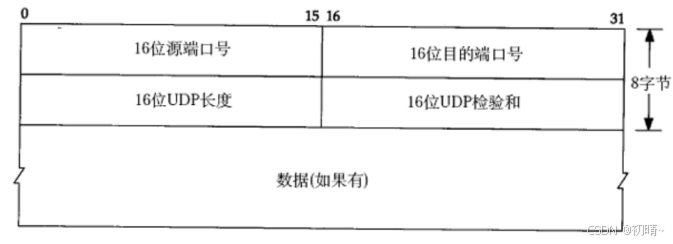
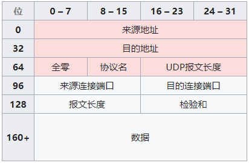

功能： 为不同主机的应用进程提供**逻辑通信**
运输层分组：**segment 报文段**

### **多路复用**与**多路分解**：

1. 关于它们的实际工作原理：
	1. **套接字**有唯一标识符
	2. 报文段上有对应标识符:
		1. **源端口号字段**(16 bit)
			1. 用做"返回地址"一部分
		2. **目标端口号字段**(16 bit)
		都在0~65535之间
		其中0~1023为**周知端口号**, 被保留给HTTP和FTP等周知应用层协议使用
2. UDP的分解与复用
	由二元组标识(包含目的ip与目的端口号)
	因此即使两个具有**相同**目的ip与目的端口号UDP套接字有**不同**源ip和源端口号也会通过**相同**目的套接字
3. TCP的分解与复用
	由四元组标识(源ip,源端口号,目的ip与目的端口号)
	这样上面的情况就能被正确分解了

	>现在的高性能web服务器一般只使用一个进程,
	>不过为每个新客户连接创建一个具有新连接套接字的新线程

### UDP 无连接运输
-  特点
	无需连接建立
	UDP没有拥塞控制
	**分组首部**较小 8字节,而TCP要20字节
- 报文段结构
	
- UDP检验和
	- 用于检测传输过程比特是否改变
	- 计算过程
		- 首先会添加一个**伪头部**(红色部分)(仅用于计算校验和)
		- 
		1. 从“伪头部”开始，按每16位当作一个数，逐次求和，最终得出一个32位的数；
		2. 如果这个32位的数的高16位不为0，则进行“回卷”操作。也就是，将其高16位与低16位相加，又得到一个32位的数；
		3. 重复第2步直到高16位为0。
		4. 最终，将低16位取反，得到校验和，填入checksum字段中
	- 差错检验
		当接收到UDP报文时，需要如何检验其正确性？方法就是将UDP报文中包括校验和在内的，所有的16位的数相加，如果低16位全为1，则没有出错。否则表明该分组中出现了错误
		- TODO
### 可靠数据传输原理
1. 构建
	1. rdt1.0
		1. **ARQ**协议(Automatic Repeat reQuest , 自动重传协议)
			1. 接收方进行差错校验后向发送方反馈**ACK**(肯定)或**NAK**(否定),如是后者则重传
			2. **停等协议** :发送方确认接收方正确收到分组后再继续发送数据的协议
	2. rdt2.0
		1. 如果考虑ACK和NAK本身有可能出错,则在收到错误的ACK和NAK后重新发一次
			1. 由于接收方要确认是否为重发的分组, 在分组中添加一个**序号**来确定
	3. rdt2.2
		1. **亢余ACK**
			1. 给ACK分组加上分组的序号, 通过发送两次ACK来确认接收方没收到序号后面的分组
			2. 可以不用NAK
	4. rdt3.0
		1. **比特交替协议**
	5. 流水线pipelining
			1. 流水线操作
			2. **回退N步协议GBN**（滑动窗口协议）
				1. 序号扩展到N
				2. 窗口大小N
				3. 每次发N个分组，如第j个丢失，接收方丢弃之后分组，发送方从第j个重传
			3. **选择重传协议SR**
				1. 失序分组先缓存起来，等接受到中间缺少分组再提交给上层
				2. 接收方和发送方各有长度为N窗口，当该窗口基分组发送后向前移动
					1. 所以接收方即使收到序号小于当前窗口基序号的分组也要发送ACK来使发送方窗口移动
					2. 这种方式要求窗口长度<＝ 序号空间一半（以分辨分组是重传还是新分组）
-  分组存活时间：
	-  避免出现在网络中停留过久的亢余分组，有助于避免分组重新排序
### TCP 面向连接运输

- 特点
	- 提供**全双工服务**（即双方应用层数据可相互传递）
	- 点对点：俩台主机
	- MSS
	- MTU
- TCP报文段结构
	- 序号和确认号
		- 序号从0到约文件字节/MSS
		- 确认号为期望收到的下一字节序号
			- 防止丢失
			- **累积确认**:TCP只流中第一个缺失的字节
-  往返时间估计与超时
	- 估计往返时间
		- 样本RTT（sampleRTT）：一个报文段发送到确认收到的时间
		- 均值EstimatedRTT：
			- $EstimatedRTT = (1-\alpha)\cdot EstimatedRTT + \alpha \cdot SampleRTT$
			- $\alpha$一般为0.125
		- RTT偏差DevRTT:
			- $DevRTT = (1-\beta)\cdot DevRTT + \beta \cdot \lvert SampleRTT-EstiamtedRTT \rvert$
			- $\beta$一般为0.25
		- 重传超时间隔TimeontInterval
			- $TimeoutInterval = EstimatedRTT + 4  \cdot DevRTT$
			- 初始值推荐1s
```
 0                   1                   2                   3
 0 1 2 3 4 5 6 7 8 9 0 1 2 3 4 5 6 7 8 9 0 1 2 3 4 5 6 7 8 9 0 1
 +-------------------------------+-------------------------------+
 |          Source Port          |       Destination Port        |
 +-------------------------------+-------------------------------+
 |                        Sequence Number                        |
 +---------------------------------------------------------------+
 |                    Acknowledgment Number                      |
 +-------+-----------+-+-+-+-+-+-+-------------------------------+
 |  Data |           |U|A|P|R|S|F|                               |
 | Offset|  Reserved |R|C|S|S|Y|I|            Window             |
 |       |           |G|K|H|T|N|N|                               |
 +-------+-----------+-+-+-+-+-+-+-------------------------------+
 |           Checksum            |         Urgent Pointer        |
 +-------------------------------+---------------+---------------+
 |        Options  (Variable Length)             |    Padding    |
 +-----------------------------------------------+---------------+
 |                    Data     (Variable Length)                 |
 +---------------------------------------------------------------+
```
- URG、ACK、PSH、RST、SYN、FIN各占1位。为标志位字段； 各占1位，取值为0或1。

(1). URG：紧急URG=1，紧急指针字段有效，优先传送；

(2). ACK：确认ACK=1，确认序号字段有效；ACK=0时，确认序号字段无效；

(3). PSH：推送PSH=1，尽快将报文段中的数据交付接收应用进程，不要等缓存满了再交付；

(4). RST：复位RST=1，TCP连接出现严重差错，释放连接，再重新建立TCP连接；

(5). SYN：同步SYN=1，该TCP报文段是一个建立新连接请求控制段或者同意建立新连接的确认段；

(6). FIN：终止FIN=1，TCP报文段的发送端数据已经发送完毕，请求释放连接。

[计算机网络之传输层－传输控制协议（TCP）-腾讯云开发者社区-腾讯云](https://cloud.tencent.com/developer/article/1753181)
